# System Configurations Landing Page Domain Knowledge

[](https://github.com/subitsonWOS/Config.git)
[](https://github.com/subitsonWOS/Config.git)
[](https://github.com/subitsonWOS/Config.git)

**Author**: Subitson Croos | **Organization**: WealthOS (WOS) | **Created**: January 2025

## Overview

**System Configurations Landing Page** is a critical enhancement that introduces a dedicated landing page with organized tabs for managing system-wide configurations. This feature provides a centralized, user-friendly interface for accessing different configuration categories, starting with the Order Configuration tab. The implementation ensures proper role-based access control, maintains audit trail integrity, and provides visual indicators for configuration status.

---

<details>
<summary>Click to expand</summary>

- [🎯 What is System Configurations Landing Page?](#-what-is-system-configurations-landing-page)
- [🏗️ Core Domain Entities](#️-core-domain-entities)
- [📊 Page Structure & Navigation](#-page-structure--navigation)
- [🔐 Role-Based Access Control](#-role-based-access-control)
- [🔄 Business Rules & Validation](#-business-rules--validation)
- [📊 Process Flows](#-process-flows)
- [🎭 Business Scenarios](#-business-scenarios)
- [🧪 Test Case Analysis](#-test-case-analysis)
- [🎬 Complete Demo Flow: Order Configuration Setup](#-complete-demo-flow-order-configuration-setup)
- [🔗 API Reference](#-api-reference)
- [📚 Additional Resources](#-additional-resources)
- [👥 Contributing](#-contributing)

</details>

---

## 🎯 What is System Configurations Landing Page?

<details>
<summary><strong>Business Value & Feature Overview</strong></summary>

### Key Business Value
- **Centralized Configuration Management**: Single landing page for all system configurations
- **Organized Navigation**: Tab-based interface for easy access to different configuration categories
- **Role-Based Security**: View access for all users, edit access restricted to Admin role
- **Visual Status Indicators**: Clear indication of configuration completion status
- **Audit Trail Preservation**: Existing audit trail functionality maintained despite UI restructuring

### Feature Overview
The System Configurations Landing Page provides a hierarchical navigation structure:

**Navigation Hierarchy**:
1. **Main Menu**: Configurations section
2. **System Configurations Section**: Dedicated section within configurations
3. **Tab View**: Order Configurations tab (default, with more tabs to be added)
4. **Configuration Details**: Individual configuration pages within each tab

**Current Implementation**:
- **Order Configurations Tab**: First tab, loads by default
- **Switch Configuration**: Existing configuration moved under Order Configuration tab
- **Future Tabs**: Investment Products, Rebalance, Settlement, Aggregation, Tolerance (planned)

### Key Enhancement Points
- **Default Tab Loading**: Order Configurations tab loads automatically
- **Breadcrumb Navigation**: Clear navigation path shown at all levels
- **Status Indicators**: Visual checkmarks and unset indicators for configuration status
- **Access Control**: Read-only mode for non-admin users, full edit access for admins
- **Audit Integration**: All configuration changes continue to be tracked in audit trail

</details>

---

## 🏗️ Core Domain Entities

<details>
<summary><strong>Configuration Landing Page, Tabs, Role Permissions, Status Indicators</strong></summary>

### 1. **System Configurations Landing Page**
- **Location**: Configurations > System configurations
- **Structure**: Tab-based interface with multiple configuration categories
- **Default Behavior**: Order Configurations tab loads by default
- **Navigation**: Breadcrumb navigation showing full path

### 2. **Order Configurations Tab**
- **Position**: Tab 1 (default)
- **Content**: Order-related configurations
- **Current Configuration**: Switch configuration (external switch management)
- **Future Configurations**: Investment Products, Rebalance, Settlement, Aggregation, Tolerance

### 3. **Configuration Status Indicators**
| Indicator | Description | Condition |
|-----------|-------------|-----------|
| **Completed (✓)** | Configuration has been set or modified | Any order configuration has been added/modified |
| **Unset (○)** | Configuration uses system defaults | All order configurations are unset or use system defaults |

### 4. **Role-Based Access Control**
| User Role | View Permissions | Edit Permissions | Button Visibility |
|-----------|-----------------|------------------|-------------------|
| **Admin** | ✅ All configurations visible | ✅ Full edit access | ✅ SAVE and CANCEL buttons visible |
| **Non-Admin** | ✅ All configurations visible | ❌ Read-only mode | ❌ SAVE and CANCEL buttons hidden |

### 5. **Breadcrumb Navigation Structure**
```
Configurations > System configurations > Order Configurations
```

### 6. **Configuration Sections**
| Section | Location | Description |
|---------|----------|-------------|
| **System configurations** | Main configurations page | New section listing all system configuration categories |
| **Order configuration** | Under System configurations | Subsection showing Order configuration status |

</details>

---

## 📊 Page Structure & Navigation

<details>
<summary><strong>Landing Page Layout & Tab Structure</strong></summary>

### Main Configurations Landing Page Structure

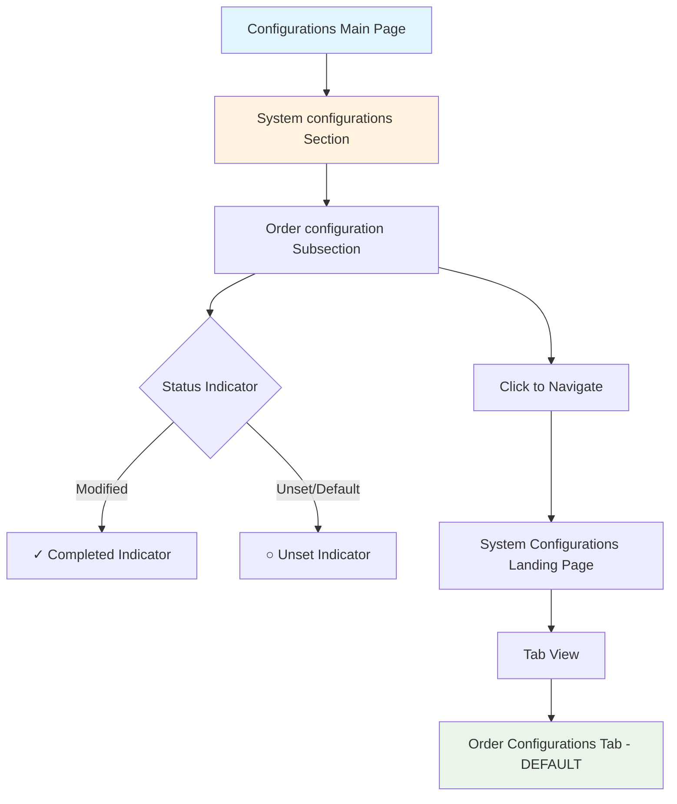

### Tab Structure Overview

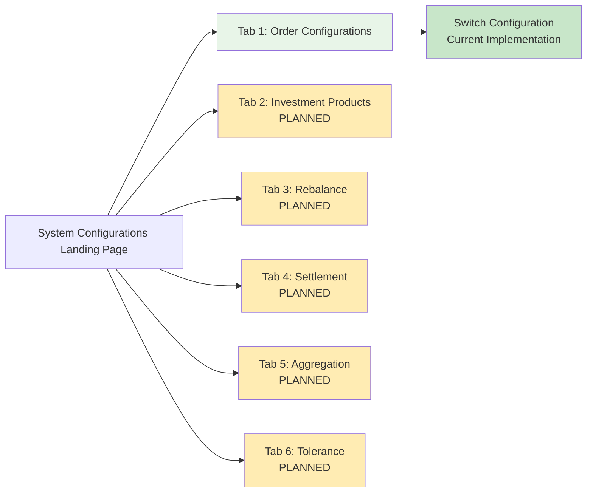

### Page Layout Components

| Component | Description | Visibility |
|-----------|-------------|------------|
| **Page Header** | "Order Configurations" title | All users |
| **Breadcrumb** | Configurations > System configurations > Order Configurations | All users |
| **Tab Navigation** | Tab headers for configuration categories | All users |
| **Tab Content** | Configuration forms and controls | All users (read-only for non-admin) |
| **Save Button** | Save configuration changes | Admin only |
| **Cancel Button** | Cancel changes and navigate back | Admin only |
| **Status Indicators** | Completion status on main page | All users |

</details>

---

## 🔐 Role-Based Access Control

<details>
<summary><strong>View & Edit Permissions Matrix</strong></summary>

### Permission Matrix

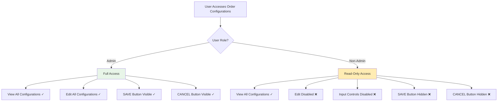

### Detailed Access Control Rules

#### Admin Users
- ✅ **View**: All configuration values visible
- ✅ **Edit**: All input controls enabled (dropdowns, text fields, toggles, radio buttons)
- ✅ **Save**: SAVE button visible and enabled when changes are made
- ✅ **Cancel**: CANCEL button always visible and enabled
- ✅ **Navigation**: Full navigation access

#### Non-Admin Users
- ✅ **View**: All configuration values visible (read-only)
- ❌ **Edit**: All input controls disabled
  - Dropdowns: Disabled
  - Text fields: Read-only
  - Toggles: Disabled
  - Radio buttons: Disabled
- ❌ **Save**: SAVE button hidden
- ❌ **Cancel**: CANCEL button hidden
- ✅ **Navigation**: Can navigate but cannot modify

### Input Control States by Role

| Control Type | Admin State | Non-Admin State |
|-------------|-------------|-----------------|
| **Dropdowns** | Enabled | Disabled |
| **Text Fields** | Editable | Read-only |
| **Toggles** | Enabled | Disabled |
| **Radio Buttons** | Enabled | Disabled |
| **Checkboxes** | Enabled | Disabled |
| **Buttons** | Enabled | Hidden/Disabled |

</details>

---

## 🔄 Business Rules & Validation

<details>
<summary><strong>Core Business Rules & Validation Logic</strong></summary>

### Navigation Rules
1. **Default Tab**: Order Configurations tab loads by default when landing page is accessed
2. **Breadcrumb Updates**: Breadcrumb updates dynamically based on current page/tab
3. **Section Structure**: "System configurations" section must exist on main configurations page
4. **Tab Visibility**: All tabs visible to all users regardless of role

### Access Control Rules
1. **View Permissions**: All user roles can view all configuration values
2. **Edit Permissions**: Only Admin role can edit configurations
3. **Button Visibility**: SAVE and CANCEL buttons only visible to Admin users
4. **Input State**: Non-admin users see all inputs in read-only/disabled state

### Status Indicator Rules
1. **Completed Indicator (✓)**: Shows when any configuration under Order Configuration section has been added or modified
2. **Unset Indicator (○)**: Shows when all Order Configuration values are unset or use system defaults
3. **Real-time Updates**: Indicators update immediately when configurations are modified

### Audit Trail Rules
1. **Preservation**: Existing audit trail functionality continues to work despite page relocation
2. **Change Tracking**: All configuration changes continue to be logged in audit trail
3. **No Impact**: Moving configurations to new page structure does not affect audit logging

### Configuration Rules
1. **Switch Configuration**: Existing switch configuration remains functional under new location
2. **Backward Compatibility**: All existing configuration functionality preserved
3. **Future Tabs**: System designed to accommodate additional tabs (Investment Products, Rebalance, etc.)

</details>

---

## 📊 Process Flows

<details>
<summary><strong>Navigation to Order Configurations Flow</strong></summary>

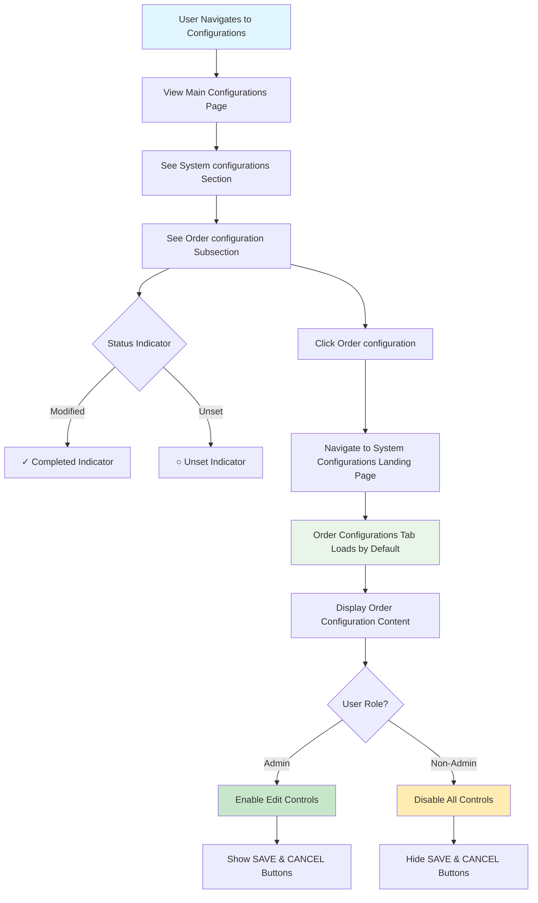

</details>

<details>
<summary><strong>Order Configuration Edit Flow (Admin)</strong></summary>

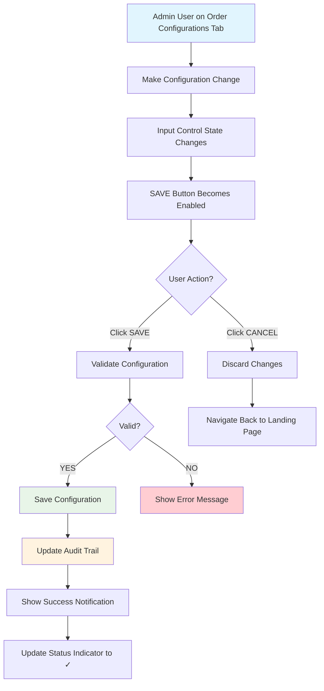

</details>

<details>
<summary><strong>Non-Admin User View Flow</strong></summary>

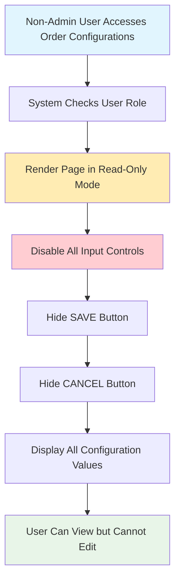

</details>

<details>
<summary><strong>Status Indicator Update Flow</strong></summary>

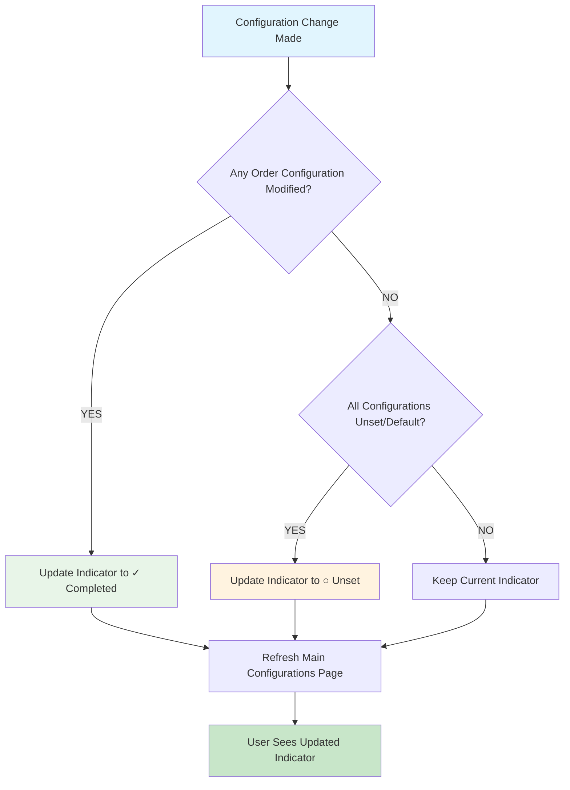

</details>

<details>
<summary><strong>Audit Trail Preservation Flow</strong></summary>

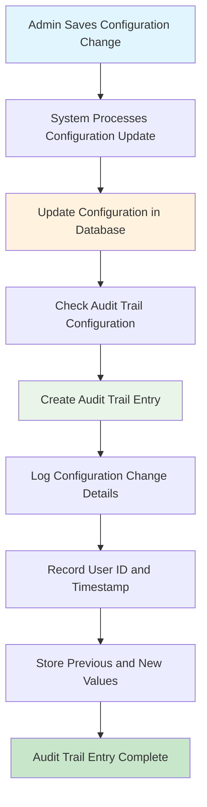

</details>

---

## 🎭 Business Scenarios

<details>
<summary><strong>Scenario 1: Admin User Editing Order Configuration</strong></summary>

**Setup**: Admin user navigates to System Configurations Landing Page
**Process**: 
- ✅ System Configurations section visible on main configurations page
- ✅ Order configuration subsection shows status indicator
- ✅ Clicking Order configuration navigates to landing page
- ✅ Order Configurations tab loads by default
- ✅ Breadcrumb shows: "Configurations > System configurations > Order Configurations"

**Edit Process**:
- ✅ All input controls enabled (radio buttons, dropdowns, etc.)
- ✅ SAVE and CANCEL buttons visible
- ✅ Making changes enables SAVE button
- ✅ Clicking SAVE saves configuration and shows success notification
- ✅ Audit trail entry created
- ✅ Status indicator updates to ✓ completed

**Result**: 
- ✅ Configuration saved successfully
- ✅ Audit trail maintains change history
- ✅ Status indicator reflects completion

</details>

<details>
<summary><strong>Scenario 2: Non-Admin User Viewing Order Configuration</strong></summary>

**Setup**: Non-admin user (any role) navigates to Order Configurations
**Process**: 
- ✅ All configuration values visible and readable
- ✅ All input controls disabled (read-only mode)
- ✅ Dropdowns: Disabled
- ✅ Text fields: Read-only
- ✅ Radio buttons: Disabled
- ✅ Toggles: Disabled

**Result**: 
- ✅ User can view all configurations
- ✅ SAVE button hidden
- ✅ CANCEL button hidden
- ✅ No modifications possible
- ✅ All information accessible for viewing purposes

</details>

<details>
<summary><strong>Scenario 3: Configuration Status Indicator Update</strong></summary>

**Setup**: User modifies Order Configuration for the first time
**Initial State**: 
- ○ Unset indicator shown on main configurations page

**Process**: 
- ✅ Admin user edits Order Configuration
- ✅ Saves changes successfully
- ✅ System detects modification

**Result**: 
- ✅ Status indicator updates from ○ Unset to ✓ Completed
- ✅ Indicator persists on main configurations page
- ✅ Future users see completed status

</details>

<details>
<summary><strong>Scenario 4: Breadcrumb Navigation</strong></summary>

**Setup**: User navigates through different levels
**Navigation Path**:
1. **Main Page**: Configurations
2. **Section Click**: System configurations
3. **Tab View**: Order Configurations (default)

**Breadcrumb Updates**:
- **Level 1**: "Configurations"
- **Level 2**: "Configurations > System configurations"
- **Level 3**: "Configurations > System configurations > Order Configurations"

**Result**: 
- ✅ Breadcrumb accurately reflects current location
- ✅ Users can navigate back using breadcrumb links
- ✅ Clear indication of page hierarchy

</details>

<details>
<summary><strong>Scenario 5: Audit Trail Preservation After Page Move</strong></summary>

**Setup**: Configuration moved from old location to new System Configurations Landing Page
**Concern**: Audit trail functionality might be affected

**Validation**: 
- ✅ Existing audit trail entries remain accessible
- ✅ New configuration changes continue to be logged
- ✅ Audit trail search and filtering still works
- ✅ User, timestamp, and change details properly recorded

**Result**: 
- ✅ No impact on audit trail functionality
- ✅ All historical changes preserved
- ✅ New changes properly tracked

</details>

<details>
<summary><strong>Scenario 6: Multiple Configuration Categories (Future)</strong></summary>

**Setup**: Additional tabs added (Investment Products, Rebalance, etc.)
**Current State**: 
- ✅ Order Configurations tab (Tab 1, default)

**Future State**:
- ⏳ Investment Products tab
- ⏳ Rebalance tab
- ⏳ Settlement tab
- ⏳ Aggregation tab
- ⏳ Tolerance tab

**Navigation**: 
- ✅ Each tab accessible via tab navigation
- ✅ Default tab remains Order Configurations
- ✅ Breadcrumb updates per tab selection

**Result**: 
- ✅ Scalable architecture for multiple configuration categories
- ✅ Consistent navigation pattern across tabs
- ✅ Status indicators work for each configuration category

</details>

---

## 🧪 Test Case Analysis

<details>
<summary><strong>AC1: Order Configurations Landing Page Structure</strong></summary>

### Test Suite 1: Page Layout and Header (AC1.A)

#### Test Case 1.1: System Configurations Section Presence
- **Precondition**: User navigates to Configurations section
- **Test Steps**:
  1. Navigate to main Configurations page
  2. Verify "System configurations" section exists
  3. Verify section is visible and accessible
- **Expected Result**: 
  - ✅ "System configurations" section displayed
  - ✅ Section clearly visible in menu/navigation

#### Test Case 1.2: Tab View Structure (AC1.B)
- **Precondition**: System Configurations landing page loaded
- **Test Steps**:
  1. Navigate to System Configurations landing page
  2. Verify tab navigation structure exists
  3. Verify tab headers are displayed
- **Expected Result**: 
  - ✅ Tab navigation structure visible
  - ✅ Tab headers properly displayed

#### Test Case 1.3: Order Configurations Tab (AC1.B1)
- **Precondition**: System Configurations landing page loaded
- **Test Steps**:
  1. Verify "Order Configurations" tab exists
  2. Verify tab name is correct
  3. Verify tab is visible
- **Expected Result**: 
  - ✅ "Order Configurations" tab displayed as Tab 1
  - ✅ Tab name matches expected text

#### Test Case 1.4: Default Tab Loading (AC1.B2)
- **Precondition**: System Configurations landing page loaded
- **Test Steps**:
  1. Navigate to landing page
  2. Verify Order Configurations tab loads by default
  3. Verify tab content is displayed
- **Expected Result**: 
  - ✅ Order Configurations tab active by default
  - ✅ Tab content visible without user interaction

#### Test Case 1.5: Breadcrumb Navigation (AC1.B3)
- **Precondition**: Order Configurations tab loaded
- **Test Steps**:
  1. Navigate to Order Configurations tab
  2. Verify breadcrumb exists
  3. Verify breadcrumb text: "Configurations > System configurations > Order Configurations"
- **Expected Result**: 
  - ✅ Breadcrumb navigation visible
  - ✅ Breadcrumb text matches expected format
  - ✅ All breadcrumb segments clickable

</details>

<details>
<summary><strong>AC2: Navigation to Order Configuration Section</strong></summary>

### Test Suite 2: Order Configuration Navigation (AC2.A)

#### Test Case 2.1: Tab Navigation (AC2.A1)
- **Precondition**: System Configurations landing page loaded
- **Test Steps**:
  1. Click on "Order Configuration" tab
  2. Verify navigation to Order Configuration page
  3. Verify page content loads
- **Expected Result**: 
  - ✅ Successfully navigates to Order Configuration page
  - ✅ Page content displayed correctly

#### Test Case 2.2: Breadcrumb Update (AC2.A2)
- **Precondition**: Order Configuration tab clicked
- **Test Steps**:
  1. Click Order Configuration tab
  2. Verify breadcrumb updates
  3. Verify breadcrumb shows: "Configurations > System configurations > Order configurations"
- **Expected Result**: 
  - ✅ Breadcrumb updates correctly
  - ✅ Text matches expected format

#### Test Case 2.3: Order-Related Configurations Load (AC2.A3)
- **Precondition**: Order Configuration tab selected
- **Test Steps**:
  1. Verify Order Configuration page loads
  2. Verify Switch configuration displayed
  3. Verify all order-related configurations visible
- **Expected Result**: 
  - ✅ All order-related configurations loaded
  - ✅ Switch configuration visible and functional

</details>

<details>
<summary><strong>AC3: Role-Based Access Control</strong></summary>

### Test Suite 3: View Permissions - All Roles (AC3.A)

#### Test Case 3.1: All Roles View Access (AC3.A1)
- **Precondition**: User with any role accesses Order Configurations page
- **Test Steps**:
  1. Login as Admin user
  2. Navigate to Order Configurations
  3. Verify all configurations visible
  4. Login as Non-Admin user
  5. Navigate to Order Configurations
  6. Verify all configurations visible
- **Expected Result**: 
  - ✅ All configurations visible for all roles
  - ✅ No restrictions on viewing

### Test Suite 4: Edit Permissions - Admin Users (AC3.B)

#### Test Case 4.1: Admin Edit Option (AC3.B1)
- **Precondition**: Admin user accesses Order Configurations page
- **Test Steps**:
  1. Login as Admin
  2. Navigate to Order Configurations
  3. Verify edit option available
  4. Verify all input controls enabled
- **Expected Result**: 
  - ✅ Edit option available for Admin
  - ✅ All input controls enabled

#### Test Case 4.2: Admin Buttons Visibility (AC3.B2)
- **Precondition**: Admin user on Order Configurations page
- **Test Steps**:
  1. Verify SAVE button visible
  2. Verify CANCEL button visible
  3. Verify buttons are enabled when changes made
- **Expected Result**: 
  - ✅ SAVE button visible and functional
  - ✅ CANCEL button visible and functional

### Test Suite 5: Edit Restrictions - Non-Admin Users (AC3.C)

#### Test Case 5.1: Read-Only Display (AC3.C1)
- **Precondition**: Non-Admin user navigates to Order Configurations
- **Test Steps**:
  1. Login as Non-Admin user
  2. Navigate to Order Configurations
  3. Verify all configuration values displayed
  4. Verify values are read-only
- **Expected Result**: 
  - ✅ All configurations visible
  - ✅ All values in read-only mode

#### Test Case 5.2: Disabled Input Controls (AC3.C2)
- **Precondition**: Non-Admin user on Order Configurations page
- **Test Steps**:
  1. Verify dropdowns disabled
  2. Verify text fields read-only
  3. Verify toggles disabled
  4. Verify radio buttons disabled
- **Expected Result**: 
  - ✅ All input controls disabled
  - ✅ No editing capability

#### Test Case 5.3: Hidden Buttons (AC3.C3)
- **Precondition**: Non-Admin user on Order Configurations page
- **Test Steps**:
  1. Verify SAVE button hidden
  2. Verify CANCEL button hidden
- **Expected Result**: 
  - ✅ SAVE button not visible
  - ✅ CANCEL button not visible

</details>

<details>
<summary><strong>AC4: Audit Trail and Change Tracking</strong></summary>

### Test Suite 6: Audit Trail Preservation (AC4.A)

#### Test Case 6.1: Audit Trail Creation
- **Precondition**: Admin user makes configuration change
- **Test Steps**:
  1. Login as Admin
  2. Navigate to Order Configurations
  3. Make configuration change
  4. Save changes
  5. Verify audit trail entry created
  6. Verify entry contains correct details
- **Expected Result**: 
  - ✅ Audit trail entry created
  - ✅ User ID, timestamp, and change details recorded
  - ✅ Previous and new values logged

#### Test Case 6.2: Audit Trail Accessibility
- **Precondition**: Configuration changes made after page move
- **Test Steps**:
  1. Access audit trail
  2. Search for Order Configuration changes
  3. Verify entries accessible
  4. Verify filtering works correctly
- **Expected Result**: 
  - ✅ Audit trail entries accessible
  - ✅ Search and filtering functional
  - ✅ Historical changes preserved

</details>

<details>
<summary><strong>AC5: Configuration Landing Page Section</strong></summary>

### Test Suite 7: System Configurations Section (AC5.A)

#### Test Case 7.1: Section Addition
- **Precondition**: User navigates to main configurations page
- **Test Steps**:
  1. Navigate to Configurations main page
  2. Verify "System configurations" section exists
  3. Verify "Order configuration" listed underneath
- **Expected Result**: 
  - ✅ "System configurations" section displayed
  - ✅ "Order configuration" subsection visible

### Test Suite 8: Status Indicators (AC5.B)

#### Test Case 8.1: Completed Indicator (AC5.B1)
- **Precondition**: Order configuration has been modified
- **Test Steps**:
  1. Admin user modifies Order Configuration
  2. Save changes
  3. Navigate to main configurations page
  4. Verify completed (check) indicator shown
- **Expected Result**: 
  - ✅ Completed indicator (✓) displayed
  - ✅ Indicator visible next to Order configuration

#### Test Case 8.2: Unset Indicator (AC5.B2)
- **Precondition**: All Order configurations use system defaults
- **Test Steps**:
  1. Ensure no Order configurations modified
  2. Navigate to main configurations page
  3. Verify unset (unconfigured) indicator shown
- **Expected Result**: 
  - ✅ Unset indicator (○) displayed
  - ✅ Indicator visible when configurations unset

</details>

---

## 🎬 Complete Demo Flow: Order Configuration Setup

<details>
<summary><strong>End-to-End Demo: System Configurations Landing Page with Order Configuration</strong></summary>

### Demo Scenario Overview
**Business Case**: Admin user needs to configure Order settings, specifically setting up external switch management. The new System Configurations Landing Page provides a centralized, organized interface for this configuration with proper role-based access control.

**Timeline**:
- **Step 1**: Navigate to Configurations main page
- **Step 2**: Access System configurations section
- **Step 3**: Navigate to Order Configurations tab
- **Step 4**: Configure external switch management
- **Step 5**: Verify status indicator updates
- **Step 6**: Verify audit trail entry

### Complete Flow Diagram

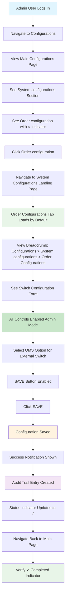

### Phase-by-Phase Implementation

#### Phase 1: Navigation to System Configurations
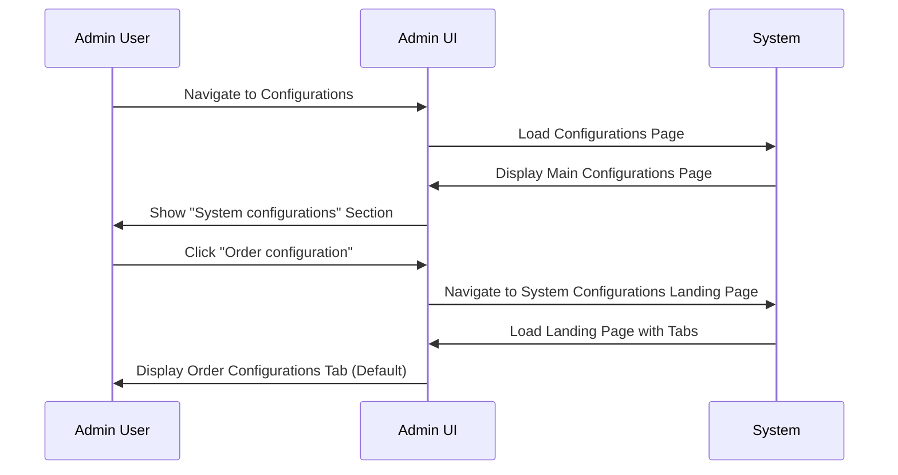

#### Phase 2: Order Configuration Access
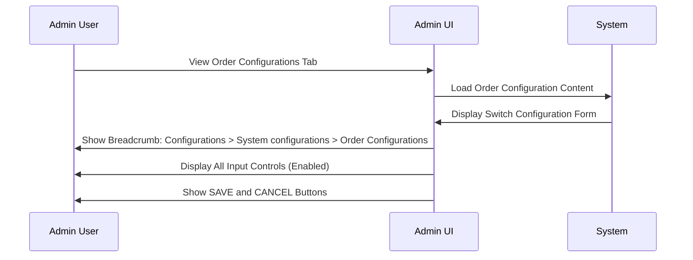

#### Phase 3: Configuration Edit
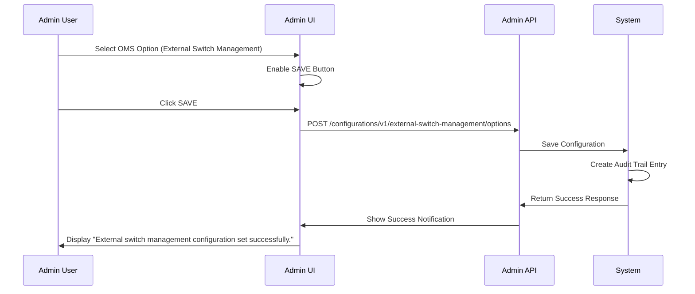

#### Phase 4: Status Indicator Update
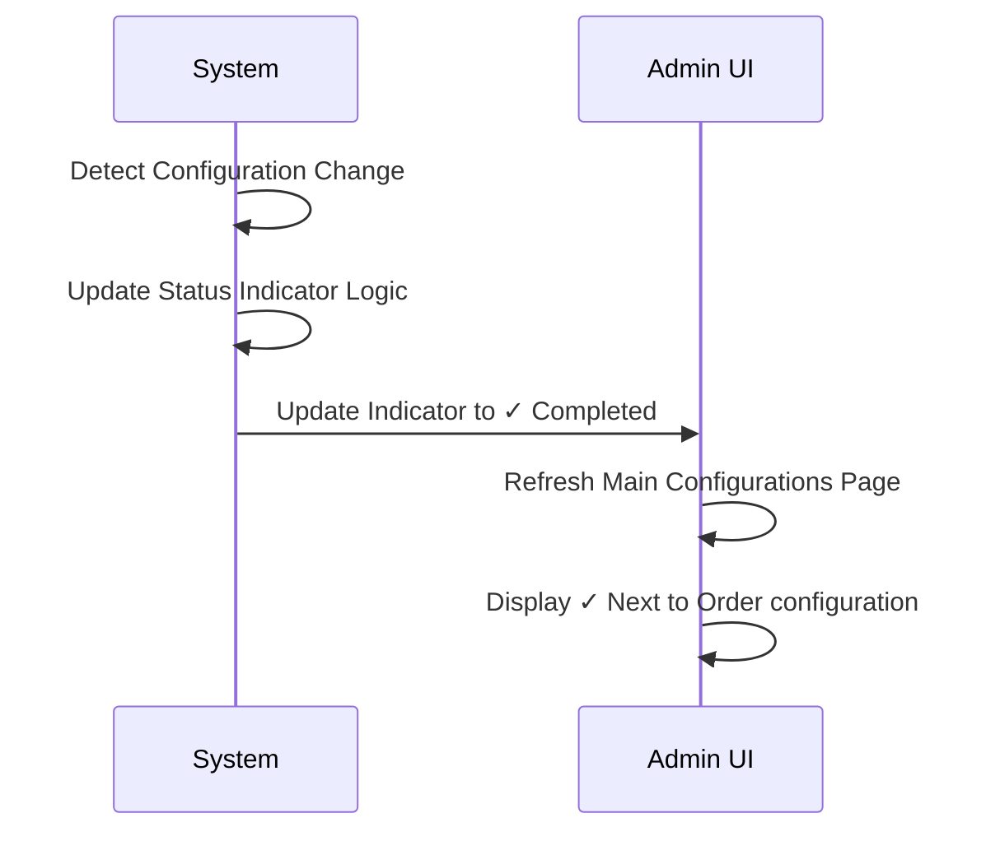

#### Phase 5: Audit Trail Verification
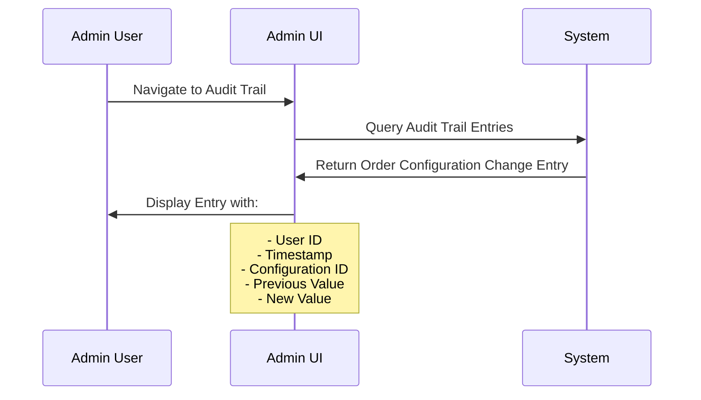

### Expected Results

#### Configuration State
| Configuration | Before | After | Status |
|---------------|--------|-------|--------|
| **External Switch Management** | WealthOS (default) | OMS (Order management system) | ✓ Saved |
| **Status Indicator** | ○ Unset | ✓ Completed | ✓ Updated |

#### Navigation Path
1. **Main Page**: Configurations
2. **Section**: System configurations
3. **Subsection**: Order configuration (with status indicator)
4. **Landing Page**: System Configurations Landing Page
5. **Tab**: Order Configurations (default)
6. **Content**: Switch Configuration form

#### API Interaction
```json
{
  "request": {
    "config_id": "external_switch_management",
    "config_params": {
      "external_switch_enabled": true
    }
  },
  "response": {
    "status": 201,
    "message": "External switch management configuration set successfully."
  }
}
```

#### Audit Trail Entry
```json
{
  "audit_entry": {
    "user_id": "admin_user_uuid",
    "timestamp": "2025-01-15T10:30:00Z",
    "config_id": "external_switch_management",
    "action": "UPDATE",
    "previous_value": {
      "external_switch_enabled": false
    },
    "new_value": {
      "external_switch_enabled": true
    }
  }
}
```

### Key Demo Points

#### For Non-Technical Audience
1. **The Problem**: Configurations were scattered, making it hard to find and manage settings
2. **The Solution**: Centralized landing page with organized tabs for easy navigation
3. **The Benefit**: Easier configuration management with clear visual indicators and proper access control

#### Technical Validation Points
- ✅ **Default Tab Loading**: Order Configurations tab loads automatically
- ✅ **Breadcrumb Navigation**: Accurate navigation path displayed
- ✅ **Role-Based Access**: Admin can edit, non-admin read-only
- ✅ **Status Indicators**: Real-time updates based on configuration state
- ✅ **Audit Trail**: All changes properly logged and accessible

### Postman Collection Structure
```
📁 System Configurations Landing Page Demo
├── 📁 Phase 1: Navigation Setup
│   ├── Login as Admin User
│   ├── Navigate to Configurations
│   └── Verify System configurations Section
├── 📁 Phase 2: Landing Page Access
│   ├── Navigate to System Configurations Landing Page
│   ├── Verify Order Configurations Tab (Default)
│   └── Verify Breadcrumb Navigation
├── 📁 Phase 3: Configuration Edit
│   ├── View Switch Configuration Form
│   ├── Select OMS Option
│   ├── POST /configurations/v1/external-switch-management/options
│   └── Verify Success Notification
├── 📁 Phase 4: Status Indicator
│   ├── Navigate Back to Main Configurations Page
│   └── Verify ✓ Completed Indicator
├── 📁 Phase 5: Audit Trail Verification
│   ├── Query Audit Trail Entries
│   ├── Filter by Configuration ID
│   └── Verify Entry Details
└── 📁 Phase 6: Non-Admin Access Test
    ├── Login as Non-Admin User
    ├── Navigate to Order Configurations
    ├── Verify Read-Only Mode
    └── Verify Buttons Hidden
```

This comprehensive demo showcases the complete lifecycle of the System Configurations Landing Page, demonstrating centralized configuration management with proper access control and status tracking.

</details>

---

## 🔗 API Reference

<details>
<summary><strong>Configuration Endpoints</strong></summary>

### Core Endpoints
| Method | Endpoint | Purpose |
|--------|----------|---------|
| `POST` | `/configurations/v1/external-switch-management/options` | Set external switch management configuration |
| `GET` | `/configurations/v1/external-switch-management/options` | Get external switch management configuration |
| `DELETE` | `/configurations/v1/deletebyConfigId/{config_id}` | Delete configuration by ID |

### External Switch Management Configuration Request
```json
{
  "config_id": "external_switch_management",
  "config_params": {
    "external_switch_enabled": true
  }
}
```

### External Switch Management Configuration Response
```json
{
  "config_id": "external_switch_management",
  "config_params": {
    "external_switch_enabled": true
  },
  "created_at": "2025-01-15T10:30:00Z",
  "updated_at": "2025-01-15T10:30:00Z"
}
```

### Response Codes
| Code | Meaning | Scenario |
|------|---------|----------|
| `201` | Created | Configuration set successfully |
| `200` | Success | Configuration retrieved successfully |
| `400` | Bad Request | Invalid configuration parameters |
| `404` | Not Found | Configuration not found |
| `403` | Forbidden | Insufficient permissions (non-admin user) |

### Configuration Object Generator (Test Utils)
```typescript
setExternalSwitchManagementConfiguration(externalSwitchEnabled: boolean = true): any {
    return {
        config_id: "external_switch_management",
        config_params: {
            external_switch_enabled: externalSwitchEnabled
        }
    };
}
```

</details>

---

## 🧪 Automation Test Coverage

<details>
<summary><strong>GUI Automation Tests</strong></summary>

### GUI Test Location
- **File**: `gui-e2e/tests/01_configurations/04_operation_settings/order_configurations.spec.ts`
- **Page Object**: `gui-e2e/pages/Configurations/operation-settings/order-configurations.ts`
- **Test Data**: `gui-e2e/tests/01_configurations/04_operation_settings/order_configurations.data.ts`

### GUI Test Scenarios
1. **Page Navigation Verification**
   - Verify page title
   - Verify breadcrumb navigation
   - Verify form labels and descriptions

2. **UI Element Verification**
   - Verify radio group (WealthOS vs OMS)
   - Verify info alert message
   - Verify button visibility and states

3. **Button Behavior**
   - Verify SAVE button disabled initially
   - Verify SAVE button enabled after changes
   - Verify CANCEL button always enabled
   - Verify button click behaviors

4. **Configuration Update Flow**
   - Select OMS option
   - Click SAVE button
   - Verify success notification
   - Verify configuration persists

5. **Navigation Testing**
   - Verify cancel button navigation
   - Verify breadcrumb navigation

</details>

<details>
<summary><strong>API Automation Tests</strong></summary>

### API Test Location
- **Directory**: `be-e2e/configurations/test/api/`
- **Test Files**: 
  - `configuration.test.ts` - General configuration tests
  - Tests in transaction modules that use external switch management configuration

### API Test Scenarios
1. **Configuration CRUD Operations**
   - Create/Set configuration
   - Get configuration
   - Update configuration
   - Delete configuration

2. **Configuration Integration Tests**
   - External switch management in switch transactions
   - PMS sync with external switch management
   - Aggregation behavior with external switch management

### API Endpoint Usage in Tests
```typescript
// Enable external switch management
const response = await adminApi.post(
    AdminApiPaths.CONFIGURATIONS_APIS.EXTERNAL_SWITCH_MANAGEMENT_OPTIONS_PATH, 
    true, 
    ConfigurationsObjectGenerator.setExternalSwitchManagementConfiguration(true), 
    true, 
    AdminApiPaths.CONFIGURATIONS_APIS.EXTERNAL_SWITCH_MANAGEMENT_OPTIONS_PATH
);
```

</details>

---

## 📚 Additional Resources

<details>
<summary><strong>Related Documentation</strong></summary>

### Internal Documentation
- **Order Configuration**: External Switch Management Configuration
- **API Documentation**: Admin API Configuration Endpoints
- **UI Components**: Configuration Page Components

### Related Features
- **Switch Transactions**: How external switch management affects switch orders
- **PMS Integration**: Order management system integration
- **Aggregation**: Transaction aggregation with external switch management

### Future Enhancements
- Investment Products tab
- Rebalance tab
- Settlement tab
- Aggregation tab
- Tolerance tab

</details>

---

## 🚀 Quick Commands

```bash
# Update repository
git add . && git commit -m "message" && git push origin main

# Clone repository  
git clone https://github.com/subitsonWOS/Config.git
```

---

**Repository URL**: https://github.com/subitsonWOS/Config.git

